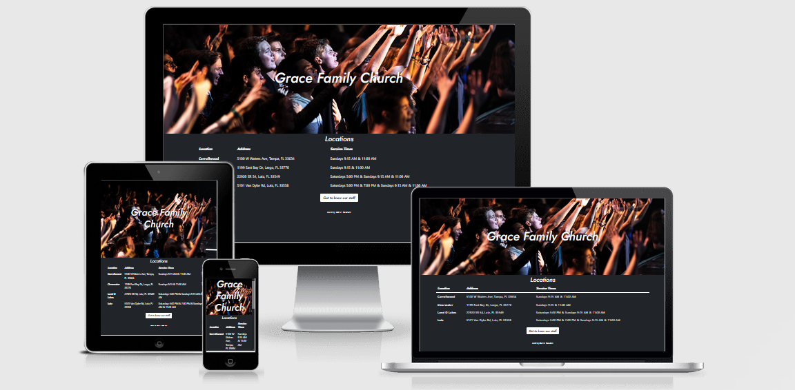

# Grace Family Church

The Live site can be found [Here](https://dgoodwin92.github.io/gracefamily/).

Created as a small project to fulfill a post interview challenge. The interviewer wanted a HTML page with an image, table and link to their current staff page within their website.

This project only uses the languages of HTML and CSS, within this project [Bootstrap](https://getbootstrap.com/) is used to create the table with responsive behaviour. I have also used Bootstraps containers to keep the project clean and responsive on multiple sized screens. 

For fonts I have used [Google Fonts](https://fonts.google.com/), The font chosen was Jost. Jost was used for the headings and text within the button. 

The image used as a hero image is from [Unsplash](https://unsplash.com/).

All the work was completed by Daniel Goodwin. 